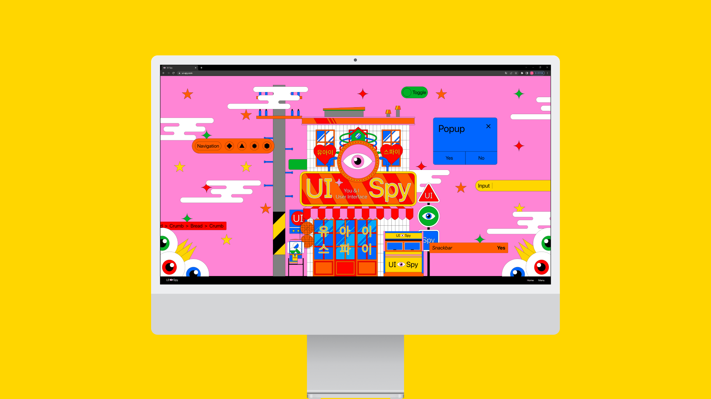
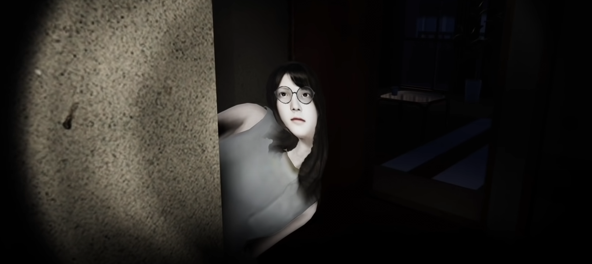

 

---

<h4> 안녕하세요, 저는 디자인을 전공을 시작으로 

  기술을 접목시켜 개발자가 되고 싶은 황민욱입니다. </h4>

 

  
기술과 인문학의 교차점

    

        
        
    

    <h4>
    흰색 빛을 나타내는 사람
    </h4>
    세상에는 여러 가지 색의 빛이 있습니다. 
     
    다양한 색의 빛들을 모두 합치면 흰색의 빛이 나옵니다.
     
    다양한 색들이 합쳐져 흰색을 이루듯이, 다방면의 지식을 융합하여 성장하고 싶습니다.
     

 

## MAJOR
디자인 전공 (B.S. in Human Environment & Design)

  
디자인 학도의 프로젝트

    

        
        
        
        
        
        
    

    <h4>
    흰색 빛을 나타내는 사람
    </h4>
    세상에는 여러 가지 색의 빛이 있습니다. 
     
    다양한 색의 빛들을 모두 합치면 흰색의 빛이 나옵니다.
     
    다양한 색들이 합쳐져 흰색을 이루듯이, 다방면의 지식을 융합하여 성장하고 싶습니다.
     

 

## EXPERIENCE
프로덕트 디자이너로 시작했으나...

콘텐츠 디자이너가 되었다.

 

## PROJECT

    

 

## HOBBY

다양한 게임을 즐겨하고 있습니다.

디자인용 그래픽카드 게임에 쓰는중

닌텐도(보유), 플스(팔음...ㅠ)

  
게임에 관하여

    

        
        
        
    

 

## 어떠한 개발자가 되고 싶은가?

 
 

 
 

기초가 탄탄한 개발자가 되고 싶습니다.

몰입의 경험 SSAFY에서!!

