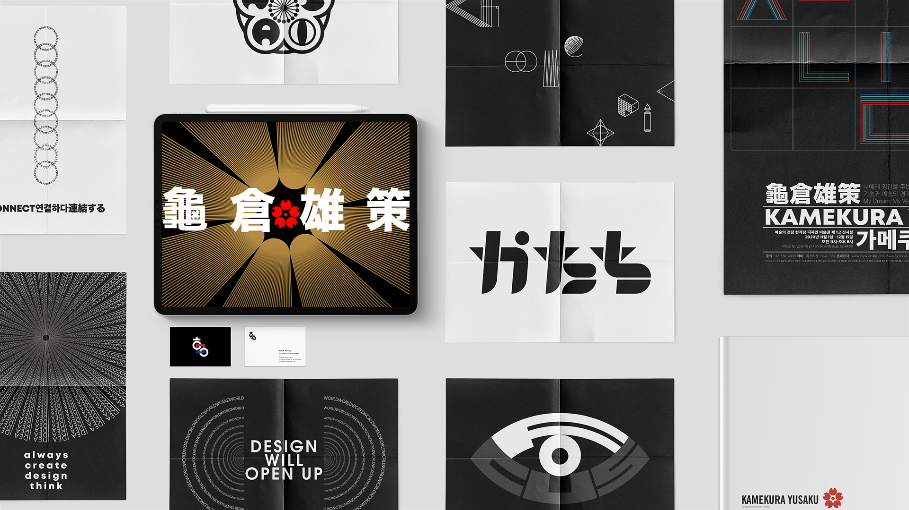
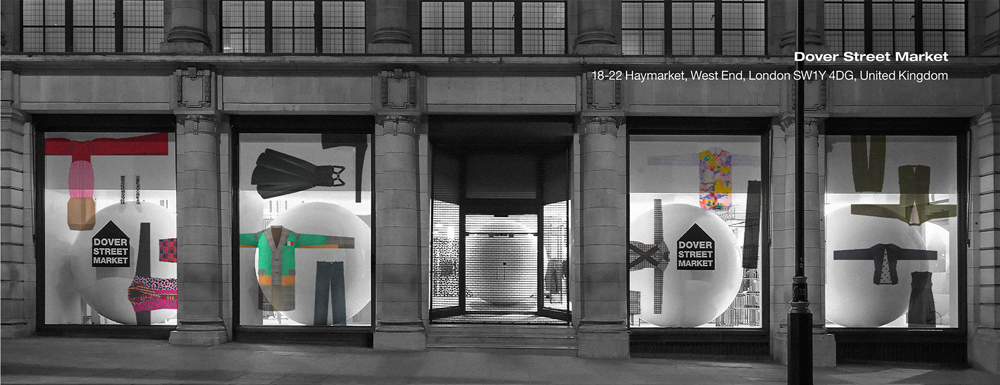
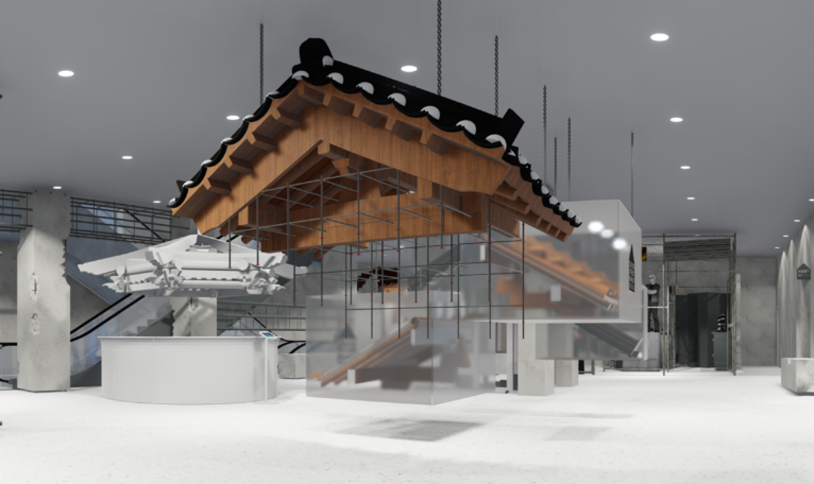
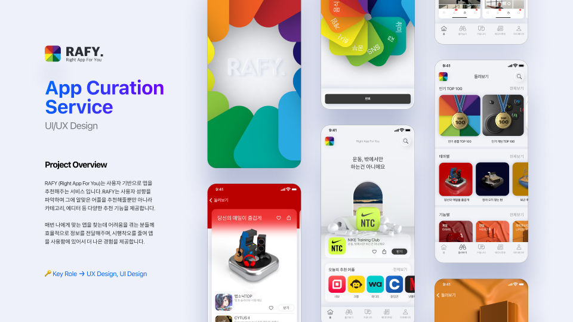
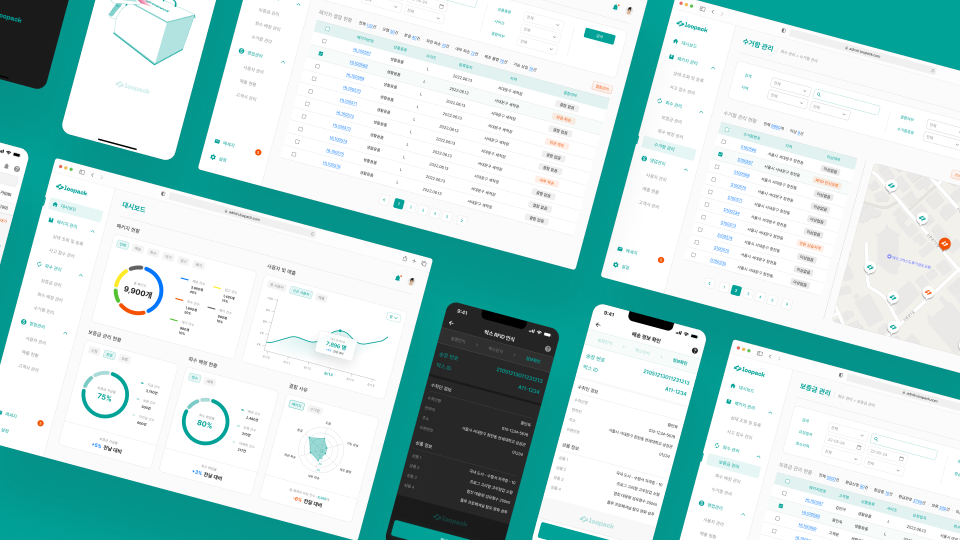
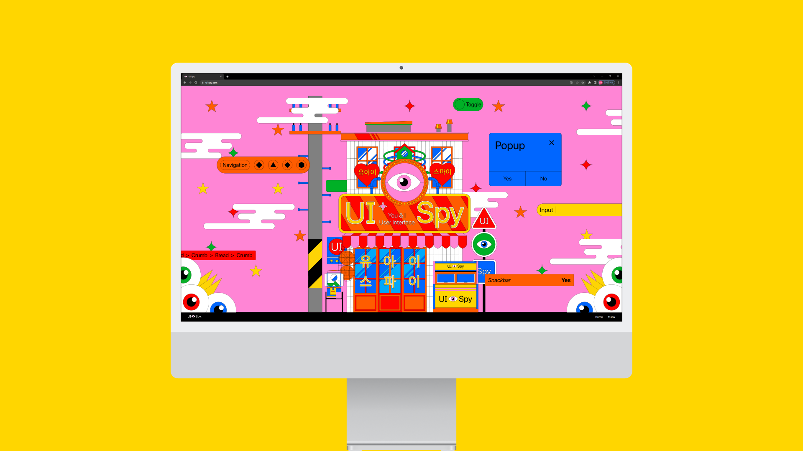
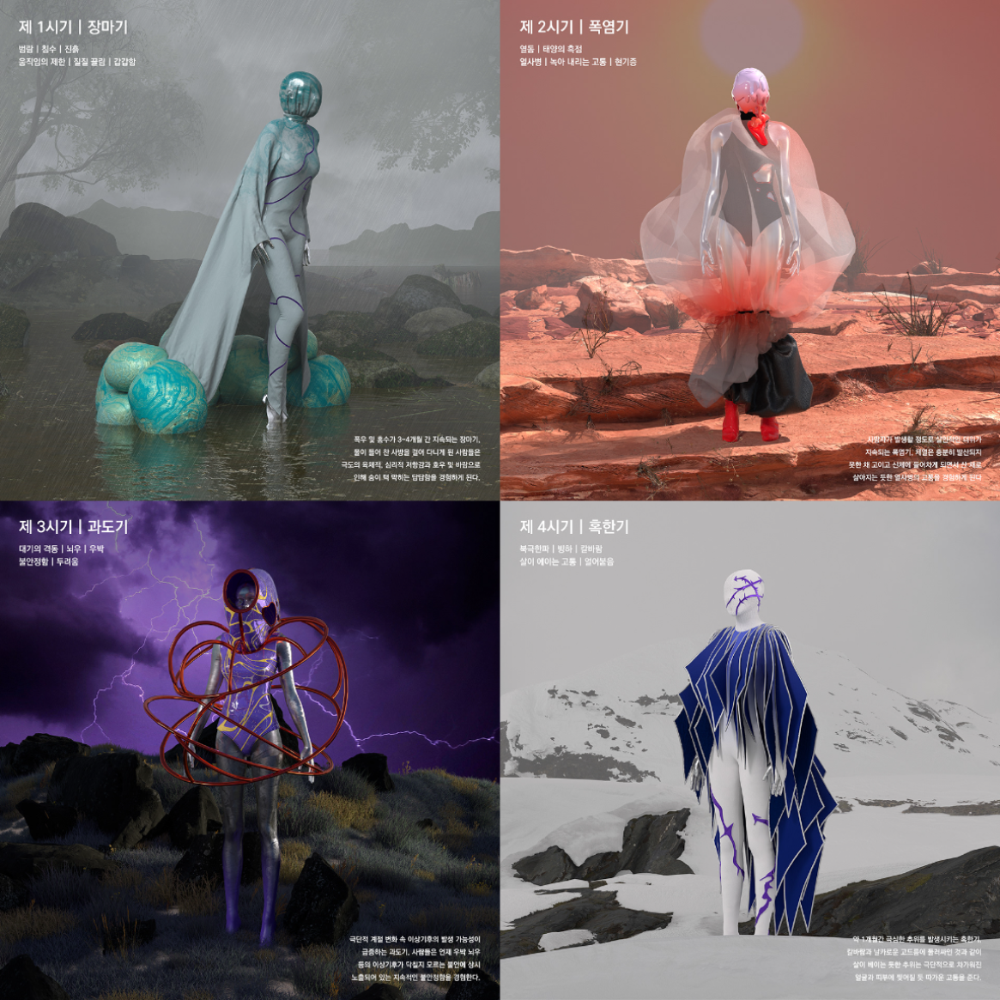

  
  
  

    
  
  

    
  

   
  
  <h3>はじめまして、ファン・ミヌクです。</h3>
  
  

    デザイン、コード、ビジネスをつなぐ<b>プロダクト志向のフロントエンドエンジニア</b>です。 
    パフォーマンスを最適化し、持続的なプロダクト成長に貢献する<b>スケーラブルなアーキテクチャ</b>を構築しています。
  

   

  

    
    
    
  

 

## 🛠 技術スタック

**コア**
 

**状態管理 & スタイリング**
 

**クリエイティブ & 3D**
 

**DevOps & ツール**
 

 

## 🚀 職務経歴

### **LOTTE Innovate（フロントエンドエンジニア）**
*2024年8月 - 現在*

> **主な成果：ファンコマースプラットフォーム（10万人以上のユーザー）のUIアーキテクチャとレンダリングパフォーマンスを最適化**

* **パフォーマンス最適化：** 2段階Sharpパイプラインでスプライトエフェクトのアセットサイズを**75%削減（8MB → 2MB）**。
* **アーキテクチャ：** Builderパターンを用いた宣言的UIアーキテクチャを設計し、実装時間を**87%短縮（1日 → 1時間未満）**。
* **決済モジュール：** ブランド別に分散した決済ロジックを**5段階フロー・10種類のエラー**で規格化し共通決済モジュールを設計。ブランド別コード**2,300行 → 30行**、連携工数**3日 → 1時間**。
* **システム設計：** **4-Layer CSSトークンアーキテクチャ**（Radix + CVA + Tailwind）で10+ブランドプラットフォームを運用。コンポーネント重複**83%+削減**、新規ブランドオンボーディング**1 man-day → 1時間未満**。

 

### **KREAM Corp.（プロダクト/コンテンツデザイナー）**
*2021年6月 - 2022年3月*

> **主な成果：データドリブンなUXデザインでユーザーエンゲージメントを向上**

* **UX戦略：** ユーザーのペインポイントを分析し、中古高級品市場向けのUXドリブンなフローを設計。
* **グロース：** 「Style Challenge」のリワード設計を刷新し、ユニークユーザー参加を**50%増加（2,000 → 3,000人）**。
* **マーケティング：** Instagramマーケティング戦略を刷新し、コンテンツの美学を向上させ**2万人以上のフォロワー増加**を達成。

**→ フロントエンドへの影響：** この経験がUI構築のアプローチを形成しました。現在はコンバージョン指標と行動データを念頭に置いてコンポーネントAPIとユーザーフローを設計しています。

 

## 💻 主要プロジェクト

### **🪐 ZeroGravity（3D感情トラッキングプラットフォーム）**
> **技術：** Next.js 15, React 19, TypeScript, Three.js (GLSL), pnpm Monorepo

日々の感情を進化する3D惑星として可視化し、感情パターンの理解を助けるWebプラットフォーム。

* **課題：** 従来のムードトラッカーはテキストログに依存しており、感情パターンを把握しづらい。
* **解決策：** 感情データを有機的な3Dビジュアルに変換。各惑星の色、テクスチャ、動きがユーザーの感情状態を反映。
* **レンダリング：** GLSLシェーダー簡素化とLOD Subdivisionで三角形数**76%削減**、**29fps → 60fps**達成。
* **バンドル最適化：** Barrel export構造改善により3Dを使用しないページへのThree.js 712KB読み込みを解消。First Load JS **58%削減**、Lighthouse **66 → 97**。
* **モノレポ：** Next.js WebとChrome拡張機能（Vite + Manifest V3）間で3DコンポーネントをシェアするためのPnpmモノレポを構築。
* **認証：** **OAuth 2.0 + JWT**（アクセス15分 / リフレッシュ30日）によるクロスコンテキスト認証を実装。

  

 

## 🎓 学歴 & コミュニティ

* **Yonsei University** - B.A. Human Environment & Design (GPA: 4.14/4.5)
* **Samsung Software Academy For Youth (SSAFY)** - Web開発（プロジェクト優秀賞）
* **Google Developer Student Clubs (GDSC)** - コアメンバー（Solution Challenge Top 100）

 

## 📈 GitHub Stats

  <picture>
    <source media="(prefers-color-scheme: dark)" srcset="https://github-readme-stats.vercel.app/api?username=minukHwang&show_icons=true&theme=dark&hide_border=true&hide_rank=true">
    
  </picture>

  <picture>
    <source media="(prefers-color-scheme: dark)" srcset="https://github-readme-stats.vercel.app/api/top-langs/?username=minukHwang&layout=compact&theme=dark&hide_border=true">
    
  </picture>

   

<b>🎨 Beyond Code: Philosophy & Visuals (Click to expand)</b>

 

  <h3>なぜ「White」なのか？</h3>
   
  

    光が合わさって<b>白</b>になるように、私は複数の分野を組み合わせて<b>価値</b>を創造します。 
    エンジニアリング、デザイン、ビジネスを統合し、 
    <b>技術的に堅牢で、視覚的に魅力的で、商業的に成功する</b>プロダクトを構築します。
  

   
  
  

    <b>🔵 エンジニアリング</b>は<i>安定性</i>を生み出す 
    <b>🟢 デザイン</b>は<i>使いやすさ</i>を生み出す 
    <b>🔴 ビジネス</b>は<i>インパクト</i>を生み出す
  

   
  
  

    <b>= ⚪️ ファン・ミヌク（The White Light）</b>
  

 

⎯⎯⎯⎯⎯⎯⎯⎯⎯⎯⎯⎯⎯⎯⎯⎯⎯⎯⎯

 

  <h3>🧩 Creative Playground</h3>
  
ビジュアル実験 & デザインアーカイブ

   

  
    

  
    

  
    

  
    

  
    

  
    

  
    

 
